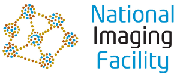

# Virtual Neuro Machine

A compact Docker container with a browser-accessible environment for reproducible neuroimaging analysis. Only the required software packages, already pre-installed, are downloaded from a public library (downloaded as containers).

Please complete the survey to help guide future additions to the software library: https://forms.gle/deKy85yniJLP4hDM8


## Quickstart
1. Install Docker from here: https://docs.docker.com/get-docker/ (Mac, Windows, Linux; for HPC/supercomputer: https://github.com/NeuroDesk/transparent-singularity)

2. Create a local folder where the downloaded software packages will be stored, e.g. ~/vnm in Mac and Linux, or C:\vnm in Windows 

3. Open a terminal, and type the folowing command to automatically download the VNM container and run it (Mac, Windows, Linux commands listed below) 

* Mac:
```
docker run --privileged --name vnm -v ~/vnm:/vnm -p 6080:80 -p 5900:5900 vnmd/vnm:20200715
```
* Windows:
```
docker run --privileged --name vnm -v C:/vnm:/vnm -p 6080:80 -p 5900:5900 vnmd/vnm:20200715
```
* Linux:
```
sudo docker run --privileged --name vnm -v ~/vnm:/vnm -p 6080:80 -p 5900:5900 vnmd/vnm:20200715
```

4. Once VNM is downloaded i.e. "INFO success: novnc entered RUNNING state" is displayed in terminal, open a browser and go to:
```
http://localhost:6080
```
or open a VNC Client and connect to port 5900

5. VNM is ready to use!


## How to launch/download applications
Click on the Launcher icon in bottom-left corner and navigate to the "VNM Neuroimaging" menu, then select the application and version you wish to launch. If it is the first time you launch the application, it will be downloaded to your desktop environment. The application is ready to use when the "Singularity>" propmpt appears in the terminal window that opens. You can now run the GUI of the application (e.g., typing 'fsl') or any other utilities included with it.

Alternatively one can download an application from the command line, e.g.:
```
bash /neurodesk/menus/fetch_and_run.sh fsl 6.0.1 20200702
```
(Notice: last argument is to be taken from https://github.com/NeuroDesk/neurodesk/blob/master/menus/apps.json)


## Stopping VNM:
1. Click on the terminal from which you ran VNM

2. Press control-C

3. Type:
```
docker stop vnm
```
4. Type:
```
docker rm vnm
```

## Start with custom screen resolution for VNC Viewer:
add the following parameter to the docker call:
```
-e RESOLUTION=1920x980
open in VNC viewer:  http://localhost:5900
```

## List of available software in the Desktop (no need to download! already included in main container)
* Datalad 0.13.0 (great interface for version control of data using git-annex)
* Fish Shell 3.1.0 (shell with autocomplete)
* Git 2.25.1 (version control)
* Git-Annex 8.20200226 (version control of data)
* GNU Image Manipulation Program 2.10.18 (Bitmap editing program)
* Julia 1.4.1 (programming language)
* Lmod 6.6 (for handling different versions of software)
* Nipype 1.5.0 (workflow system for neuro-imaging)
* Python 3.8.2 (programming language)
* Rclone v1.50.2 (rsync for cloud storage providers)
* Rsync 3.1.3 (synchronization of data)
* Singularity 3.5.3 (container runtime)
* Visual Studio Code 1.46.1 (code editor and development environment)

## This gives you a list of available images:
https://github.com/NeuroDesk/caid/packages
```
curl -s https://github.com/Neurodesk/caid/packages | sed -n "s/^.*\/NeuroDesk\/caid\/packages\/.*>\(.*\)\(\S*\)<\/a>$/\1/p"
```

## This gives you a list of all tested images available in neurodesk:
https://github.com/NeuroDesk/neurodesk/blob/master/menus/apps.json
```
curl -s https://raw.githubusercontent.com/NeuroDesk/neurodesk/master/menus/apps.json
```

## How to use applications from the command line
1. Open a terminal window (there is a terminal icon in the bottom application bar)
2. Examine the list of downloaded packages that shows up in the terminal window
3. Use the 'module' command, giving the desired downloaded package as an argument, e.g.
```
module load fsl_6.0.1
```
4. Call the programs/scripts included in the package as you would do if it was installed on your desktop, e.g.
```
fsleyes
```

## Desktop modifications
* window tiling is set to: SHIFT-ALT-CTRL-{left,right,up,down}

## Acknowledgments



